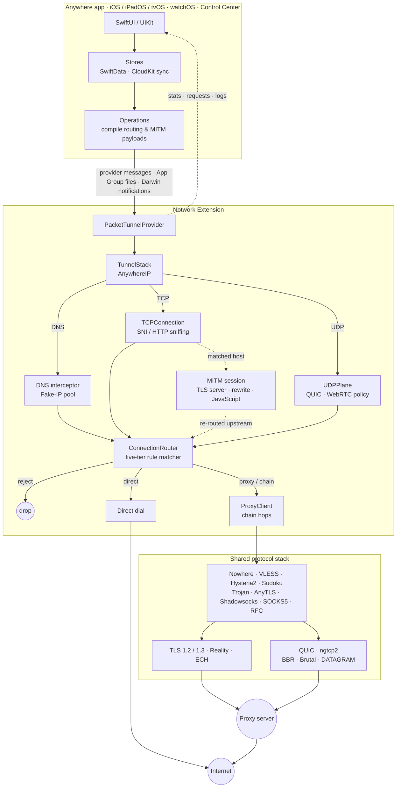

<div align="center">

<div>
    <a href="https://apps.apple.com/us/app/id6758235178">
        
    </a>
</div>

# Anywhere

**The best native proxy client for iOS, iPadOS, and tvOS.**

A native, zero-dependency proxy client built entirely in Swift.
No Electron. No WebView. No sing-box wrapper. Pure protocol implementation from the ground up.

<div>
    <a href="https://apps.apple.com/us/app/id6758235178">
        
    </a>
</div>

</div>

---

## Why Anywhere?

Most iOS proxy clients wrap sing-box or Xray-core in a Go/C++ bridge. Anywhere takes a different approach — every protocol, every transport, the QUIC stack, and the entire packet tunnel are implemented natively in Swift and C. The result is a smaller binary, lower memory usage, tighter system integration, and no bridging overhead.

## Features

### Highlights

- **Native core** — Swift 6 with strict concurrency, the native AnywhereIP TCP/IP stack, and vendored C for ngtcp2 and BLAKE3. No Go or C++ core, no bridging layer, no third-party networking packages. A single codebase builds the iOS, iPadOS, tvOS, and watchOS apps, the packet tunnel, and the Control Center controls.
- **Native TLS stack** — TLS 1.2 and 1.3, client and server, implemented in Swift. Browser-exact ClientHello fingerprints for Chrome, Firefox, Safari, and Edge; Encrypted Client Hello from an inline configuration or from DNS HTTPS records; hybrid X25519 and ML-KEM key shares. The same stack terminates TLS for MITM and provides the handshake primitives for Reality.
- **Native QUIC stack** — ngtcp2 driven from Swift, with BBR, CUBIC, and Brutal congestion control, connection migration, DATAGRAM frames, session resumption, and pluggable packet obfuscation. One engine serves Hysteria2, Nowhere, and XHTTP over HTTP/3.
- **Multi-stage routing** — a five-tier matcher built from domain-suffix tries, keyword automata, and CIDR tries classifies each destination at DNS time through Fake-IP, at connect time before the TCP handshake is accepted, and again mid-connection from the sniffed TLS SNI. Bundled service, ad-block, and country-bypass rule sets are complemented by importable and subscribable `.arrs` rule sets.
- **Built-in MITM** — HTTPS is terminated with a generated root CA. HTTP/1.1 and HTTP/2 traffic is rewritten by declarative rules or JavaScript, HTTP/2 clients are bridged to HTTP/1.1 upstreams, and script-initiated HTTP requests are dialled through the tunnel's own routing.
- **Purify and DNS** — a QUIC policy that fails HTTP/3 fast so that routing and MITM act on HTTP/2, WebRTC and UDP blocking, DNS-leak prevention, and independent plain or DoH resolvers for proxy servers, IP rules, subscriptions, ECH, and fallback.
- **Platform integration** — a native Apple TV app, an Apple Watch companion, Control Center toggles for VPN and mode, and iCloud sync through CloudKit.
- **Engineered for the extension budget** — global buffer ledgers, connection caps, and pressure throttling keep the packet tunnel within the Network Extension memory limit. The tunnel stack, TCP connections, and MITM sessions are actors bound to a per-tunnel serial executor, so the packet path never changes threads.

### Protocols

| Protocol | Runs over | Highlights |
| --- | --- | --- |
| **Nowhere** | TCP · UDP | Independent upload and download carriers over TLS or QUIC, paired per flow · Morph masking applied beneath TLS · credit-scheduled multiplexing over TLS · early data on flow open · UDP over QUIC DATAGRAM |
| **VLESS** | TCP · UDP | Post-quantum `mlkem768x25519plus` encryption with 0-RTT · XTLS-RPRX-Vision · Reality with browser fingerprints · WebSocket, HTTPUpgrade, gRPC, and XHTTP transports · XHTTP over HTTP/1.1, HTTP/2, and HTTP/3 with upload/download detach and XMUX pooling · XUDP |
| **Hysteria2** | UDP | Brutal congestion control with server-negotiated bandwidth, or BBR · Salamander and Gecko obfuscation, the latter splitting handshake packets · UDP over QUIC DATAGRAM with fragmentation |
| **Sudoku** | TCP | Payload encoded as Sudoku-grid hints with per-direction ASCII or entropy layouts and randomly selected custom tables · KIP X25519 handshake with session rekeying · HTTP masquerade in legacy, stream, poll, and WebSocket modes · pure-downlink mode · native multiplexing |
| **Trojan** | TCP | Authentication header carried in the first payload without an additional round trip · UDP relayed over the same TLS stream |
| **AnyTLS** | TCP | Server-driven padding scheme with ranges, checkpoints, and runtime updates · warm pool of idle TLS sessions shared across connections · heartbeat keepalive · UDP-over-TCP |
| **Shadowsocks** | TCP · UDP | Shadowsocks 2022 with BLAKE3 key derivation, replay protection, and multi-user identity headers, alongside classic AEAD ciphers · native UDP with shared multi-flow sessions |
| **SOCKS5** | TCP · UDP | Full UDP ASSOCIATE with a native datagram relay that follows the proxy chain · username / password authentication |
| **RFC** | TCP | `CONNECT` over HTTP/1.1 or HTTP/2, selected by ALPN · HTTP/2 multiplexes tunnels on a single TLS session with flow control and pooling · Basic authentication · plaintext or TLS |

### Architecture



## Documentation

- [Routing Rule System](Documentations/Routing.md) — developer guide to authoring routing rule sets and the `.arrs` import format: rule types, the domain-suffix / keyword and CIDR matching semantics, and the source-tier priority model.
- [MITM Rewrite System](Documentations/MITM.md) — developer guide to authoring TLS interception rule sets and `process(ctx)` scripts: the import format, rule operations, rewrite actions, and the full `Anywhere` scripting API.

## Deep Links

Anywhere registers several URL schemes so external apps and websites can trigger proxy import directly.

### `anywhere://` Scheme

```
anywhere://add-proxy?link=<link>
```

`<link>` can be any URL the app supports: a subscription URL, a `nowhere://` link, a `vless://` link, an `ss://` link, etc.

> **Note:** The `link` parameter is parsed by taking everything after `?link=` verbatim, so the inner URL does **not** need to be percent-encoded. For example, `anywhere://add-proxy?link=https://example.com/sub?token=abc&foo=bar` works as expected.

### Import Rule Sets

```
anywhere://add-rule-set?link=<arrs-or-amrs-url>&link=<arrs-or-amrs-url>
```

Import one or more routing (`.arrs`) and MITM (`.amrs`) rule sets from remote links. Pass one `link` query item per rule set; routing and MITM links may be mixed freely.

> **Note:** Unlike `add-proxy`, each `link` is a standard URL query item, so multiple links are supported. Percent-encode a link only if it carries its own reserved characters (`&`, `=`, `#`).

### Proxy URI Schemes

Tapping any of the following links on iOS will open Anywhere and pre-fill the full URI in the Add Proxy view for import:

`nowhere://` · `vless://` · `hysteria2://` (`hy2://`) · `sudoku://` · `trojan://` · `anytls://` · `ss://` · `socks5://` (`socks://`) · `rfc://`

### Integration Example

Link from a webpage:

```html
<a href="anywhere://add-proxy?link=https://example.com/subscription">Import Subscription</a>
```

Open from another iOS app:

```swift
if let url = URL(string: "anywhere://add-proxy?link=nowhere://key@host:443?up=udp&down=udp") {
    UIApplication.shared.open(url)
}
```

## Related Projects

<table>
<tr>
<td width="100" valign="middle">
<a href="https://apps.apple.com/us/app/id6766003090"></a>
</td>
<td valign="middle">
<a href="https://github.com/NodePassProject/Everywhere"><b>Everywhere</b></a><br>
<sub>One app. Three networking engines. Your rules.</sub>
</td>
</tr>
</table>

## License

The Anywhere **source code** is licensed under the [GNU General Public License v3.0](LICENSE). You are free to use, study, modify, and redistribute the source under the terms of that license.

Because Anywhere is GPLv3, anyone who distributes the app — original or modified — must, at a minimum:

- **Keep it open source** — provide the *complete corresponding source code* of their version to all recipients under the GPLv3, including every modification (GPLv3 §5 & §6). Shipping a binary without making its source available is not permitted.
- **Declare their changes** — carry prominent notices stating that the files were changed, with the date of each change (GPLv3 §5a), and preserve all existing copyright, license, and attribution notices.
- **License the whole under the same terms** — release the entire modified work under the GPLv3, adding no further restrictions on the code itself.

## Trademarks & Branding

The GPLv3 applies to the **source code only**. It does **not** grant any right to use the Anywhere name or branding. The following are proprietary and are **not** covered by the GPLv3 or any other open-source license:

- The names **"Anywhere"** and **"Anywhere Proxy"**
- The **Anywhere app icon**, together with any other Anywhere logos, marks, and brand assets

These remain the exclusive property of NodePassProject and may not be used without prior written permission, except for fair nominative references to the official app.

**Argsment Limited** is the official issuer and publisher of the Anywhere app (including the App Store release) and is fully authorized to act for and represent Anywhere and the NodePassProject team in all matters — including any licensing of, or permission to use, the names, app icon, and brand assets above. Requests for permission may be directed to Argsment Limited.

Restricting use of these marks is **not** an "additional restriction" forbidden by the GPL — GPLv3 §7(e) expressly lets the copyright holder decline to grant trademark rights, so the open-source obligations above and the branding terms here are fully consistent.

In addition to the GPLv3 obligations above, if you fork, build, or redistribute this project you **must remove or replace** the "Anywhere" and "Anywhere Proxy" names and the Anywhere app icon with your own branding before distribution. You may not publish a build under the "Anywhere" or "Anywhere Proxy" name, or carrying the Anywhere app icon, in any app store or elsewhere, in a way that could imply it is the official app or is endorsed by NodePassProject.

---

© 2026 NodePassProject. The Anywhere app is issued and published by **Argsment Limited**, which is fully authorized to represent Anywhere. **"Anywhere"**, **"Anywhere Proxy"**, and the Anywhere app icon are trademarks of NodePassProject and may not be used without permission.

If you find Anywhere useful, consider starring the repo. It helps others discover it.
